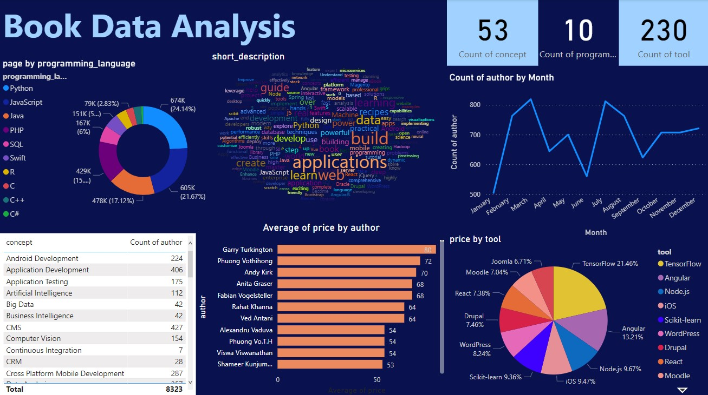

# Book-Data-Analysis-using-Power-BI

An interactive report on Packt Books dataset created using Power BI Desktop. The dataset contains series of books about programming language concepts and book information such as book image URL or page number etc.

## Clean the dataset
<ol>
  <li>The datatype of column was changed.
  <li>Substrin 'By' was removed from 'author' column.
  <li>Substring '$' was removed from 'price' column.
  <li>Rows having blank values were removed.
</ol>

## Report Snapshot

